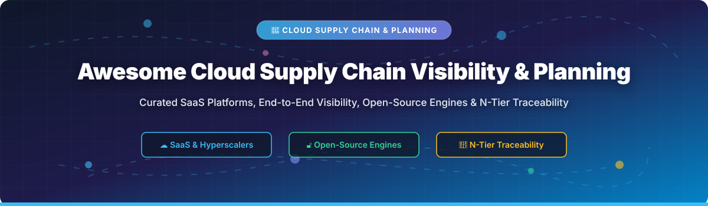

# Awesome-Cloud-Supply-Chain-Visibility-Planning

# Awesome-Cloud-Supply-Chain-Visibility-Planning 🚚 ☁️

  

  

  

  

  

  

  

---

## 🌟 Top Cloud Supply Chain Visibility & Planning Ecosystem

**Curated List of Commercial Supply Chain Platforms & Open-Source Planning Tools**  

*Focused on End-to-End Supply Chain Visibility, Demand & Supply Planning, N-Tier Supplier Collaboration, Traceability & Self-Hosted Planning Engines*

**Last updated: October 2026** 📅

---

### 📌 Overview & SEO Summary

Welcome to the ultimate curated directory of **cloud supply chain visibility platforms**, **open-source planning engines**, and **traceability frameworks**. Whether you are looking for enterprise-grade commercial solutions (such as *AWS Supply Chain*, *o9 Solutions*, and *Kinaxis*), or self-hostable open-source alternatives (like *OpenBoxes*, *supplycm*, and *planr*), this list covers category leaders, AI-driven planning, and privacy-respecting supply chain orchestration.

---

## 📑 Table of Contents

- [🏢 SaaS & Commercial Platforms](#-saas--commercial-platforms)

- [🔓 Open-Source GitHub Projects](#-open-source-github-projects)

- [🛠️ How to Contribute](#%EF%B8%8F-how-to-contribute)

- [📊 Star History](#-star-history)

- [🤝 Support & Sponsorship](#-support--sponsorship)

- [⚠️ Disclaimer](#%EF%B8%8F-disclaimer)

---

## 🏢 SaaS / Commercial Platforms

The cloud supply chain visibility and planning market spans **hyperscaler supply chain applications** (AWS Supply Chain) that provide **cloud-native visibility and planning** without platform migration, and **specialized planning platforms** (o9, Kinaxis, Blue Yonder) that offer **AI-driven integrated business planning**. **o9 Solutions** was named a **Leader in the 2026 Gartner Magic Quadrant for Supply Chain Planning Solutions (Discrete Industries)** and is the **only vendor selected as Customers' Choice in the 2025 Gartner Peer Insights Voice of the Customer report** . **AWS Supply Chain** provides **usage-based pricing** with **no upfront costs** and can be deployed in **minutes with data ingestion in about half a day** .

| SaaS / Commercial Platform | Company / Owner | Valuation / Market Cap | Standard Edition Starting Price | Free Tier / Free Trial Limits | Description |

| :--- | :--- | :--- | :--- | :--- | :--- |

| **[AWS Supply Chain](https://aws.amazon.com/supply-chain/)** ☁️ | Amazon | ~$2.0 Trillion | **Usage-based** (data volume + function executions) | **No upfront costs**; pay-as-you-go | **Cloud-native supply chain application** — **Unified data lake** connects ERP, WMS, TMS, and OMS systems . **ML-powered insights** for inventory risk alerts, lead time risk, and demand forecasting . **N-Tier Visibility** for supplier collaboration and multi-tier supply chain visibility . **Amazon Q** for natural language queries and "what-if" scenario analysis . **Sustainability** tracking for ESG metrics and compliance . |

| **[o9 Solutions (Digital Brain)](https://o9solutions.com/)** 🧠 | o9 Solutions | Private | **Custom enterprise pricing** | **Demo available** | **AI-driven integrated planning platform** — **Leader in 2026 Gartner Magic Quadrant for Supply Chain Planning (Discrete Industries)** . **Enterprise Knowledge Graph (EKG)** enables **1,000x faster data exploration** vs traditional databases . **Unified data model** connects demand, supply, inventory, capacity, and financial planning . **Supplier collaboration** with 2nd and 3rd tier risk visibility . **Scenario planning** with financial impact (P&L) visualization . |

| **[Kinaxis RapidResponse](https://www.kinaxis.com/)** ⚡ | Kinaxis | ~$4 Billion (Public) | **Custom enterprise pricing** | **Demo available** | **Concurrent planning platform** — **Real-time supply chain planning** with what-if scenario modeling. **End-to-end visibility** from demand to supply. **Used by large enterprises** in automotive, life sciences, and consumer goods. |

| **[Blue Yonder](https://blueyonder.com/)** 🔵 | Blue Yonder (Panasonic) | ~$8 Billion (Acquisition) | **Custom enterprise pricing** | **Demo available** | **AI-driven supply chain platform** — **End-to-end planning and execution**. **Luminate** platform for digital supply chain transformation. |

| **[SAP Integrated Business Planning (IBP)](https://www.sap.com/products/integrated-business-planning.html)** 🏢 | SAP SE | ~$200 Billion | **Custom enterprise pricing** | **Demo available** | **Enterprise planning suite** — **Demand, supply, inventory, and S&OP planning**. **Integrated with SAP ERP and S/4HANA**. **Real-time analytics and simulation**. |

| **[Manhattan Associates](https://www.manh.com/)** 📊 | Manhattan Associates | ~$15 Billion (Public) | **Custom enterprise pricing** | **Demo available** | **Supply chain commerce platform** — **Warehouse management, transportation, and omni-channel**. **Unified commerce** for retail and distribution. |

| **[E2open](https://www.e2open.com/)** 🌐 | E2open | ~$2 Billion (Public) | **Custom enterprise pricing** | **Demo available** | **End-to-end supply chain platform** — **Multi-enterprise collaboration** and visibility. **Channel data management** and **global trade compliance**. |

| **[project44](https://www.project44.com/)** 🚚 | project44 | Private | **Custom pricing** (per shipment/tracking) | **Demo available** | **Real-time transportation visibility** — **Carrier network integration** for shipment tracking. **Predictive ETAs** and **exception management**. |

| **[FourKites](https://www.fourkites.com/)** 📍 | FourKites | Private | **Custom pricing** (per shipment/tracking) | **Demo available** | **Real-time supply chain visibility** — **Multi-modal tracking** for truckload, LTL, ocean, rail, and parcel. **Yard management** and **appointment scheduling**. |

| **[Coupa Supply Chain](https://www.coupa.com/)** 💰 | Coupa Software | ~$8 Billion (Thoma Bravo) | **Custom enterprise pricing** | **Demo available** | **Supply chain design and planning** — **Network design, inventory optimization, and demand planning**. **Integrated with Coupa BSM** for end-to-end spend management. |

---

## 🔓 Open-Source GitHub Projects

*Sorted by GitHub_Stars_Count (Descending)* 🌟

- **[OpenBoxes](https://github.com/openboxes/openboxes)**   

  **Open-source supply chain and inventory management platform**, Eclipse Public License. **Born in hospitals and pharmacies** — powers Partners In Health supply chain across **six countries and dozens of facilities** . **Multi-facility stock management** with **lot tracking, expiry alerts, and real-time visibility**. **Demand forecasting and consumption reports** help plan replenishments before problems start. **FEFO picking and expiry alerts** reduce waste from stockouts and expiry. **REST APIs** for integration with DHIS2, ERP systems, and custom tools. **Deploy self-hosted or fully managed** via OpenBoxes Lift. **Teams typically go live within 2 to 4 weeks** — import existing data, configure locations and products, and start shipping. **The most production-proven open-source supply chain platform** for healthcare, warehouses, and distribution. 🏥

- **[planr](https://github.com/nguyen-n/planr)**   

  **R package for supply chain planning and inventory optimization**, open-source. **Distribution Requirement Planning (DRP)** calculates replenishment plans and projected inventories from just **5 key inputs**: DFU (item/location), Period, Demand, Opening Inventory, and Supply Plan . **Constrained demand calculation** determines what quantity can be answered considering projected inventories, with **Current Stock Available tagging** to show demand covered by opening inventory . **Goods in transit projection** with ETA/ETD and transit lead time tracking. **Monthly to weekly demand conversion** for granular planning. **Safety stock coverage (SSCov)** and **Multiple Order Quantity (MOQ)** parameters for real-world constraints. **The most complete open-source supply chain planning library** for R users. 📦

- **[supplycm](https://github.com/atqatq/supplycm)**   

  **Pure-Python library of 397 supply chain management algorithms with zero external dependencies**, MIT licensed. **All algorithms are public-domain / patent-free** for educational and commercial use . **Categories include**: **forecasting** (50 algorithms: moving averages, exponential smoothing, Croston, AR/MA), **inventory** (60: EOQ/EPQ, newsvendor, lot-sizing, ABC/XYZ analysis), **statistics** (40: MAPE, RMSE, MASE, hypothesis tests), **routing** (30: TSP, VRP, assignment problem), **network** (30: shortest paths, MST, max-flow), **scheduling** (40: Johnson's rule, NEH, CPM/PERT), **MRP** (30: BOM explosion, MPS, kanban), **optimization** (30: simplex, GA, SA, PSO), **supplier** (30: AHP, TOPSIS, DEA), **warehouse** (10: slotting, picking, cross-dock), and **demand** (9: aggregation, seasonality, sensing). **Pure Python — no NumPy, pandas, or third-party dependencies** . **The most comprehensive open-source supply chain algorithm library** — 397 algorithms, zero dependencies. 🐍

- **[WOM (Weekly Operation Model)](https://github.com/Yasushi-Osugi/wom)**   

  **Python-based global supply chain planning and simulation system**, open-source. **Combines a lot-based weekly PSI (quantity) model with a Cost/Profit Structure Ratio (financial) model**, bridging **weekly operational execution with management decision-making** . **Includes industrial case studies** across multiple sectors: confectionery, electric vehicles, apparel, smartphones, oil, rice, and other consumer/industrial goods. **Reproducible research artifacts** for supply chain planning education and simulation. **The most comprehensive open-source supply chain simulation framework** with real-world case studies. 📊

- **[FoodVibes AI (Microsoft)](https://github.com/microsoft/foodvibes-ai)**   

  **Supply chain traceability platform for EUDR, FSMA, and food safety regulations**, MIT licensed. **Built for the European Union's Deforestation-free product regulation (EUDR)** and **FDA's Food Safety and Modernization Act (FSMA)** . **3W tracking (When, What, Where)** through three immutable ledgers: **GeoTrack Ledger** (registered locations), **Product Ledger** (product instances), and **Tracking Products Ledger** (transformations and movements) . **Role-based information access** — data visibility limited by roles and product-level associations. **Remote sensing integration** with FarmVibes.ai for satellite-based deforestation analysis and geospatial insights . **Built on immutable ledgers** preventing data manipulation. **The most production-ready open-source traceability platform** for regulatory compliance. 🌍

- **[Trace-X (Eclipse Tractus-X)](https://github.com/eclipse-tractusx/traceability-foss)**   

  **Open-source parts traceability application for Catena-X automotive network**, Apache-2.0 licensed. **Empowers SMEs to large OEMs** to participate in parts traceability with an open-source solution . **Display the relations of the automotive value chain** based on a standardized IT model. **Overview and transparency across the supplier network** enable faster intervention based on recorded events. **Notifications and messages** regarding quality-related incidents with supply chain inspection tools. **List, view, and publish manufactured parts** based on **BoM AsBuilt** and **planned parts** based on **BoM AsPlanned**. **Visualized parts tree** with supplier parts (SingleLevelBomAsBuilt) and customer parts (SingleLevelUsageAsBuilt) . **Cloud-agnostic with Helm charts** for deployment on different cloud solutions. **The reference implementation for Catena-X traceability** — automotive industry standard. 🚗

- **[traceRoot](https://github.com/Adam-Muyobo/traceRoot)**   

  **Blockchain-based supply chain transparency system with QR codes**, open-source. **Each product tagged with unique QR code** for tracking: Origin (farm location), Processing (refining/conversion), Logistics (shipping/handling), and Retail (pricing/value) . **Workflow**: Farm level → Processing → Logistics → Retail → Consumers scan QR codes. **Blockchain integration** for immutable records. **Smart contracts** automate updates and payments. **Potential challenges**: data accuracy validation, scalability (layer-2 solutions), QR tampering (tamper-evident tags and NFC), and adoption incentives . **Future improvements**: IoT sensors for real-time capture, consumer rewards, and interoperability with existing systems. **The most accessible open-source blockchain traceability implementation**. 🔗

- **[Open SourceMap](https://github.com/sourcemap/sourcemap)**   

  **World's largest public repository of supply chains**, open-source. **Launched in 2008 at MIT** as a supply chain management platform rooted in **transparency** . **Open Factory Registry** matches names and addresses of **hundreds of thousands of factories** worldwide. **Sourcemap Enterprise** was the **first platform designed to manage multi-tier supply chains**, including **advanced database technology that traces individual products from raw materials to end customers** . **Award-winning visualizations** for supply chain transparency. **The most established open-source supply chain transparency platform** — 15+ years of development. 🗺️

- **[Craftplan](https://github.com/puemos/craftplan)**   

  **Open-source ERP for small-scale artisanal manufacturers and craft businesses**, open-source. **Catalog & BOM**: product catalog with photos, versioned Bills of Materials (older versions read-only), automatic cost rollups across nested BOMs, labor steps with time and cost tracking . **Orders & Invoices**: customer order processing with calendar-based scheduling, invoice generation, order item allocation to production batches. **Production**: batching with automatic material consumption, cost snapshots per batch. **Inventory**: raw material management with **lot traceability**, stock movements, **allergen and nutritional fact tracking**, **demand forecasting and reorder planning** . **Purchase orders and supplier management** with receiving into stock with lot creation. **Self-hosted, no vendor lock-in** — your data stays on your infrastructure. **The most purpose-built open-source ERP for artisanal manufacturing**. 🎨

---

## 🛠️ How to Contribute

Contributions are welcome! Follow these steps to submit new supply chain platforms or open-source planning software:

1. 🍴 **Fork** the repository.

2. 📝 **Add/edit** entries in `README.md` maintaining table/list structure and formatting.

3. 🔗 Include project title, official website/GitHub link, exact Stars_Count, license, and brief description.

4. 🚀 Submit a **Pull Request** with a descriptive summary of your changes.

---

## 📊 Star History

---

## 🤝 Support & Sponsorship

If you find this supply chain visibility and planning repository useful, please consider supporting the project:

- ⭐ **Star** this repository to increase visibility!

- 🔀 **Fork** and share with fellow supply chain professionals, operations teams, and open-source advocates.

- ☕ **Sponsor & Buy Me a Coffee**: Support ongoing open-source curation via the [GitHub Sponsor Dashboard](https://github.com/sponsors/ishandutta2007).

---

## ⚠️ Disclaimer

- This is a **community-curated** list — not exhaustive and not an endorsement. ℹ️

- **AWS Supply Chain is usage-based** with no upfront costs — **data volume and function executions** drive the bill . **Deployment takes minutes with data ingestion in about half a day** . **Amazon Q** provides natural language queries and "what-if" scenario analysis .

- **o9 Solutions was named a Leader in the 2026 Gartner Magic Quadrant for Supply Chain Planning (Discrete Industries)** and is the **only vendor selected as Customers' Choice in 2025 Gartner Peer Insights** . **Enterprise Knowledge Graph enables 1,000x faster data exploration** vs traditional databases .

- **Open-source tools (OpenBoxes, planr, supplycm) are not turnkey** — **OpenBoxes requires PHP/MySQL deployment** but **teams go live within 2 to 4 weeks** . **planr requires R environment** . **supplycm is pure Python with zero dependencies** . **Always validate planning algorithms against your specific business constraints** before production deployment. 🚚

---

  <b>Made with ❤️ for supply chain professionals, operations teams, and open-source planning advocates.</b>

